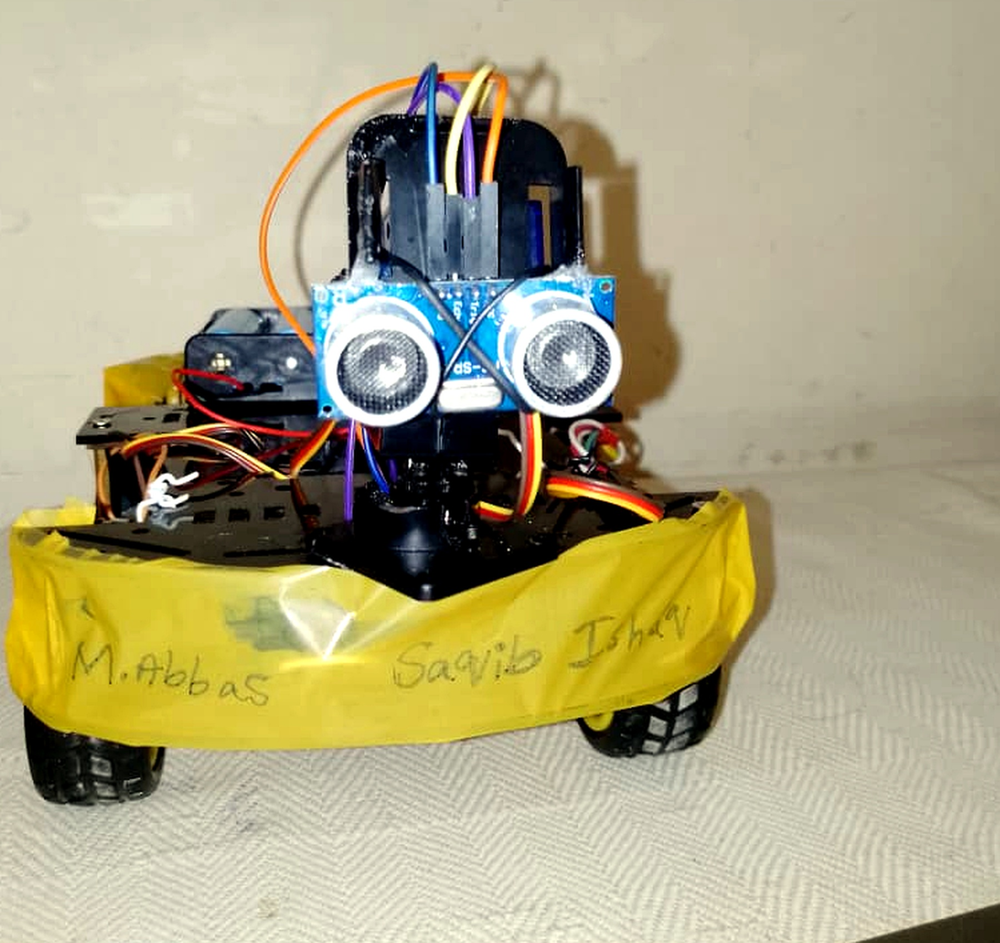
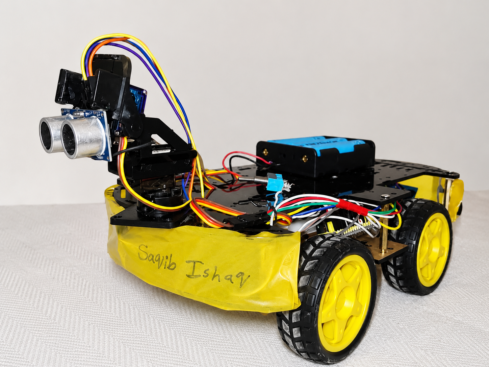

# STM32 Dual-Mode Autonomous Robotic Car

## Overview

This project is a dual-mode robotic rover developed using the STM32F103 Blue Pill microcontroller. The rover can operate in both Manual Mode and Autonomous Mode.

In Manual Mode, the rover is controlled wirelessly through a mobile phone using the HC-05 Bluetooth module. In Autonomous Mode, the rover detects obstacles using an HC-SR04 ultrasonic sensor and scans left/right using a servo motor to find a safer direction.

The project was developed as an embedded systems and robotics learning platform focusing on motor control, wireless communication, PWM generation, and autonomous navigation.

---

## Features

* Bluetooth mobile control
* Autonomous obstacle avoidance
* Dual operating modes
* PWM motor speed control
* Servo-based environment scanning
* Ultrasonic distance sensing
* Real-time command handling
* Embedded C programming on STM32

---

## Hardware Used

* STM32F103C8T6 Blue Pill
* HC-05 Bluetooth Module
* HC-SR04 Ultrasonic Sensor
* SG90 Servo Motor
* L298N Motor Driver
* DC Gear Motors
* Li-ion Battery Pack
* LM2596 Buck Converter
* Chassis Kit

---

## Software Used

* Keil uVision
* Embedded C
* RoboRemo Mobile App
* STM32 Standard Peripheral Registers

---

## System Operation

### Manual Mode

The rover receives commands from a mobile phone through Bluetooth:

* Forward
* Backward
* Left
* Right
* Speed Control
  Rover will keep moving untill button is pressed, when button released rover will stop moving
### Autonomous Mode

The rover automatically:

1. Detects obstacles
2. Stops movement
3. Rotates servo left/right
4. Measures clear distance
5. Selects safer direction

---

## Project Images

### Front View

### Side View

## Robotic Car Demo Video

---
## Project Report

[Download Full Project Report](Project Report/Project_Report.pdf)
## Future Improvements

* ESP32-CAM live video streaming
* GPS navigation
* NRF24L01 long-range communication
* AI-based object detection
* Path Planning
* Multiple Sensor for Obstacle detection to remove the time delay due to servo

---

## Author

Saqib Ishaq
PIEAS / Embedded Systems & Robotics Enthusiast
